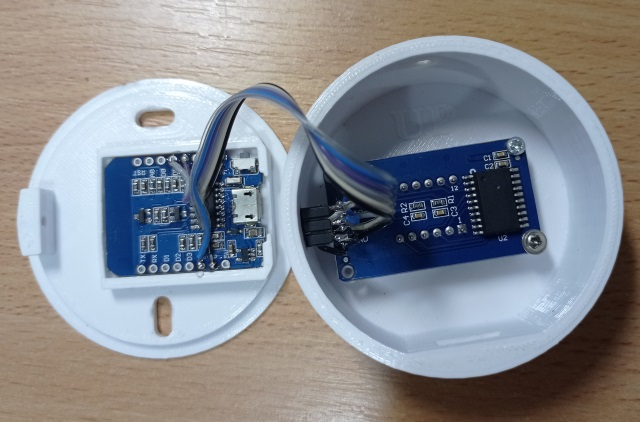

# Měřidlo nabití akumulační nádrže
Když jsem si do svého domu nainstaloval topení s kotlem na tuhá paliva a akumulační nádrží Dražice NADO 750/200 v1, celkem mně zajímalo, jak se nádrž chová při nabíjení, vybíjení a v klidu. Dále mne zajímaly tepelné úniky a jak se vrství teplota v nádrži. V neposlední řadě bych ocenil, kdybych dokázal spočítat a ukázat procentuální nabití nádoby pro snazší odhad, kdy se má znovu zatopit.

Dražice NADO 750/200 v1 kombinuje akumulační nádrž topení a zásobník TUV. Disponuje dvěma jímkami pro teplotní čidla. Už při prvních pokusech měření teploty jsem zjistil, že měření pouze se dvěma čidly je pro mé účely naprosto nedostačující. Proto jsem zabrouzdal na internetu a pokusil se najít, zda někdo neřešil podobný problém. Bohužel se mi nepodařilo najít hotové řešení. Ale v nějaké diskuzi jsem narazil na příspěvek, kde diskutér popsal nápad o přilepení několika teplotních čidel přímo na povrch nádoby. Nechal jsem se tímto nápadem inspirovat a sestavil jsem jednoduché měřidlo. S velkým překvapením to překonalo mé očekávání.

## Čidla

Jako první jsem se pustil do čidel. Použil jsem 10 kusů čidel DS18B20, které jsem zapojil paralelně na tří-žílovou duhovou kšandu. Délku kšandy (resp. vzdálenost prvního čidla od posledního) jsem zvolil stejnou, jako je rozteč jímek čidel na nádrži. V mém případě 1049 mm. Tedy při počtu 10ti čidel je rozteč mezi jednotlivými čidly 116,5 mm. Pomocí ALU lepící pásky jsem čidla přilepil k povrchu nádrže tak, aby první a poslední čidlo bylo ve stejné úrovni, jako jsou jímky. Viz obrázek.

Pozn. Bacha na levné čínské kopie DS18B20. Nechal jsem se nachytat a koupil jsem 20ks podezřele levných čidel z eBay. Odchylka od skutečné teploty byla 6-9K. Čidla jsem si pak musel zkalibrovat podle přesnějšího referenčního teploměru. Do firmware jsem proto doplnil proměnnou pro korekci čidel. Více o kopiích DS18B20 je popsáno třeba zde: https://github.com/cpetrich/counterfeit_DS18B20


## Měřidlo

Pro sběr a vyhodnocení dat jsem použil modul Arduino Wemos kompatibilní. Modul má integrovanou WiFi a má dostatečný počet GPIO. Jako zobrazovač jsem použil Arduino hodinový displej s řadičem TM1637. Aby to nejen fungovalo, ale i vypadalo, vytisknul jsem si na 3d tiskárně malou krabičku, do které se vše pohodlně vejde. Data pro 3d tisk jsou v adresáři *housing*.


Schéma zapojení měřidla




Vnitřní zapojení krabičky


Měřidlo v provozu

## Fimware pro Wemos

Zdrojové kódy měřidla se nacházejí v adresáři *wemos_18B20_sensor*. Projektový soubor *wemos_18B20_sensor.ino* zajišťuje funkčnost a soubory *peripherals.cpp* a *peripherals.h* zajišťují obsluhu teplotních čidel a displeje. Aby bylo možné zkompilovat tento projekt, je zapotřebí do Aurduino IDE doinstalovat podporu desky esp8266 a následně vybrat správnou Arduino desku. V mém případě **LOLIN(WEMOS) D1 mini (clone)**, který jsem kopil na eBay. 

Dále je zapotřebí doinstalovat knihovny:

-  TM1637 - Grove 4-Digital Display by Seeed Studio
- OneWire by Paul Stroffregen
- DallasTemperature by Miles Burton

Ve zdrojovém kódu je zapotřebí doplnit:

- SSID a heslo WiFi, do které se bude měřidlo připojovat
- seznam adresy všech deseti čidel DS18B20 (seznam **sensorsAddr[TEMP_SENSORS_CNT]**)
- případné korekce čidel (seznam **sensorsCorrections[TEMP_SENSORS_CNT]**)

Veškerá měřená data z čidel jsou dostupná přes ModbusTCP (port 502) v input registrech 100 (čidlo S1) až 109 (čidlo S10). Teploty jsou v registrech ukládány v setinách °C.

## Sběr dat

Pro snadný sběr a následnou analýzu dat jsem napsal jednoduchý Python skript, který každých 10s periodicky vyčítá data z měřidla a ukládá je do MySQL (resp. MariaDb) databáze. Použití relační databáze pro tyto účely není úplně šťastné, ale u mne doma to bylo nejsnazší řešení, protože můj NAS server ji nativně podporuje. Pro omezení počtu mysql queries skript posílá nasbíraná data jednou za minutu. Zdrojové kódy se nacházejí v adresáři *data_acquire*. Hlavní program se nachází v souboru *HeaterDAQ.py*. V tomto souboru je třeba doplnit následující:

- mysql.host - adresa MySQL serveru
- mysql.user - uživatelské jméno do databáze
- mysql.passwd - heslo do databáze
- dbName - jméno databáze, do které se budou ukládat data
- dbTable - tabulka výše zmíněné databáze, do které se budou ukládat data

## Analýza dat a výpočet nabití nádrže

K analýze a vizualizaci dat jsem použil Grafanu. Nabízí dost možností a funkcí pro práci s daty. 

Pro výpočet procentuálního nabití nádrže jsem po zvážení několika algoritmů dospěl k závěru, že nejvhodnějším, a také nejjednodušším, řešením je použití obyčejného aritmetického průměru teplot všech čidel a následná transformace lineární funkcí na procenta. Algoritmus je výpočetně velmi jednoduchý a má dostatečnou přesnost a stabilitu.

Výpočet vypadá následovně:
$$
cap = (avg[T1:T10] - TempMin) / (TempMax - TempMin) * 100
$$


Konstanty **TempMax** a **TempMin** jsou v kódu měřidla k nalezení pod názvy **HEATER_TANK_MAX_AVG_TEMP** a **HEATER_TANK_MIN_AVG_TEMP**. V mém případě se osvědčili tyto hodnoty: 

```
#define HEATER_TANK_MIN_AVG_TEMP    45
#define HEATER_TANK_MAX_AVG_TEMP    77
```

Data z Grafany pak vypadají například takto:


Horní graf ukazuje data z jednotlivých čidel. Dolní graf ukazuje procentuální nabití nádrže a cykly spínání oběhového čerpadla. V grafech je od začátku viděl pozvolné vybíjení nádrže vlivem teplených ztrát. V cca 21hod je vidět drobný odběr teplé vody a v 6 hod ráno se sepnulo oběhové čerpadlo a topilo na komfortní teplotu. Následně ve 13 hod jsem zatopil v kotli. 

## Závěr

Nejen v grafech z Grafany je vidět, že měřidlo teploty ukazuje teplotu poměrně dobře. Výpočet procentuálního nabití nádrže odpovídá aktuálnímu stavu a z grafu je patrné, že tato hodnota nijak nekolísá a je velmi stabilní. Měřidlo nadmíru splnilo mé očekávání a informace na displeji je natolik intuitivní, že to pochopila i moje žena. Inu, i z malého nápadu se dá udělat celkem hezký projekt. ;-)